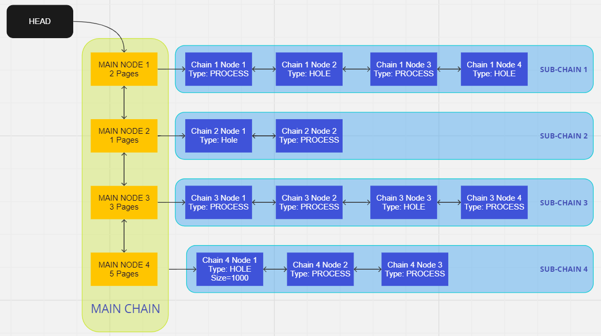
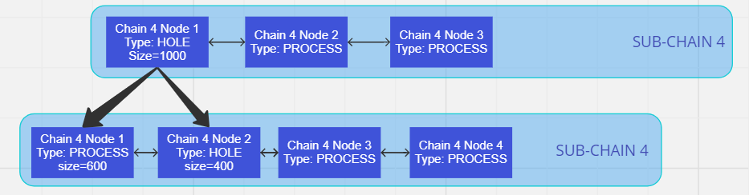

##  MeMS (Memory Management System)

## Introduction

MeMS is a custom memory management system implemented in C, utilizing system calls `mmap` and `munmap` for memory allocation and deallocation respectively. This project aims to manage heap memory efficiently while adhering to strict constraints and requirements.

## Problem Statement

Implement a memory management system (MeMS) using only `mmap` and `munmap` system calls. The project must meet the following criteria:

- Use `mmap` to request memory from the OS in multiples of the system's `PAGE_SIZE`.
- Manage memory allocation and deallocation through a custom free list structure.
- Provide functions for memory allocation (`mems_malloc`) and deallocation (`mems_free`) which should be used exclusively by the user program.

## FreeList Structure
- Free List is represented as a doubly linked list. Let's call this doubly linked list as the main chain of the free list. The main features of the main chain are:
- Whenever MeMS requests memory from the OS (using mmap), it adds a new node to the main chain.
- Each node of the main chain points to another doubly linked list which we call as sub-chain. This sub-chain can contain multiple nodes. Each node corresponds to a segment of memory within the range of the memory defined   by its main chain node. Some of these nodes (segments) in the sub-chain are mapped to the user program. We call such nodes (segments) as PROCESS nodes. Rest of the nodes in the sub-chain are not mapped to the user         program and are called as HOLES or HOLE nodes.
- Whenever the user program requests for memory from MeMS, MeMS first tries to find a sufficiently large segment in any sub-chain of any node in the main chain. If a sufficiently large segment is found, MeMS uses it to      allocate memory to the user program and updates the segment’s type from HOLE to PROCESS. Else, MeMS requests the OS to allocate more memory on the heap (using mmap) and add a new node corresponding to it in the main       chain.
  The structure of free list looks like below:

  

The main features of the chain (sub-chain) are:
- Each chain is broken into segments.
- Each segment represents a part of memory and represents whether that segment is of type PROCESS i.e. is mapped to the user process or is of type HOLE i.e. not allocated/mapped to the user program.
- The segments of type HOLE can be reallocated to any new requests by the user process. In this scenario, if some space remains after allocation then the remaining part becomes a new segment of type HOLE in that sub-chain.
  Graphaphically it looks something like below:

  

**The program makes sure that while allocation and minimal fragmentation happens giving rise to such holes in memory.**

## Memory Address Translation

- Just like OS maintains a mapping from virtual address space to physical address space, MeMS maintains a mapping from MeMS virtual address space to MeMS physical address space. 
- So, for every MeMS physical address (which is provided by mmap), we need to assign a MeMS virtual address. 
- As you may understand, this MeMS virtual address has no meaning outside the MeMS system.
- We can get the MeMS physical address (i.e. the actual address returned by mmap) corresponding to a MeMS virtual address by using the function mems_get function.

  

## Constraints and Requirements

1. **System Calls**: MeMS should only use `mmap` and `munmap` for memory management.
2. **PAGE_SIZE**: Memory should be requested in multiples of the system's `PAGE_SIZE`.
3. **Free List**: Maintain a doubly linked list structure (`main chain` and `sub-chain`) to manage allocated (`PROCESS`) and unallocated (`HOLE`) memory segments.
4. **Virtual and Physical Address Mapping**: Manage a mapping from MeMS virtual addresses to MeMS physical addresses.
5. **User Program Interaction**: Users interact with MeMS using MeMS virtual addresses, which are translated to MeMS physical addresses for memory operations.

## Implementation Details

1. **`void mems_init()`**:

   - Initialized global variables such as `main_ptr` (head of the new mapped page), `structs_curr` (points to the current address in the structs page), `main_head` (points to the head of the memory page), `mem_ptr` (points to the memory locations), `sub_head`, `total_pages`, and `starting_virtual_addr` (a global defined at the start of initialization of the system).

2. **`void mems_finish()`**:

   - Traversed along the whole `main_chain` nodes and unmapped the entire memory contained in them.

3. **`int custom_ceil()`**:

   - Self-defined function used to calculate the number of pages needed to provide memory in `mems_malloc()`.

4. **`void* mems_malloc(size_t size)`**:

   - The function is split into two halves:
     - The first half is called when `mems_malloc()` has been called for the first time. Pages are created for structs and memory using `mmap()`, and `mem_ptr` and `struct_curr` are initialized.
     - The second half deals with adding main and sub nodes into the structs page and allocating corresponding memory to the memory page by incrementing the `mem_ptr`. Checks have also been implemented to handle cases when memory allocation exceeds the page size.

5. **`void mems_print_stats()`**:

   - Utilizes multiple while loops to traverse along the `main_chain` and `sub_chain` and print the required statistics.

6. **`void* mems_get(void* v_ptr)`**:

   - Accesses the physical address by incrementing the starting address of the subnode (`sub_node->m_start`) by an offset (`(v_ptr - sub_node->vas)`).

7. **`void mems_free(void* v_ptr)`**:

   - Runs a while loop on the `MainNode` and then on the `sub_chain_nodes`. Finds the node that needs to be freed, turns it to a hole and then combines it with an already existing hole.

## Assumptions:

1. Two lines in `mems_free` providing optimization to the structs page have been commented out. They may need to be uncommented in the future if necessary.
   - Line: `structs_curr -= sizeof(struct SubChainNode);`

2. After the `make` command is run, a few warnings might occur. However, these warnings are not related to the functioning of the `mems` system and are just recommendations. The demonstration section verifies that the system works without adhering to these changes.

##Credits 
- credits to https://github.com/Rahul-Agrawal-09/MeMS-Skeleton-code/blob/main/mems.h , you can clone this repo and create your own implementation of MeMS from scratch.

## Demonstration:

### TEST CASE-1:

#### For 10 arrays of 250 integers
##### Allocated virtual addresses [mems_malloc]
- Virtual address: 1000
- Virtual address: 9192
- Virtual address: 17384
- Virtual address: 25576
- Virtual address: 33768
- Virtual address: 41960
- Virtual address: 50152
- Virtual address: 58344
- Virtual address: 66536
- Virtual address: 74728

##### Assigning value to Virtual address [mems_get]
- Virtual address: 1000   Physical Address: 140572339220480
- Value written: 200

##### Printing Stats [mems_print_stats]
- MAIN[1000:9191]-> P[1000:5799] <-> H[5800:9191] <-> NULL
- MAIN[9192:17383]-> P[9192:13991] <-> H[13992:17383] <-> NULL
- MAIN[17384:25575]-> P[17384:22183] <-> H[22184:25575] <-> NULL
- MAIN[25576:33767]-> P[25576:30375] <-> H[30376:33767] <-> NULL
- MAIN[33768:41959]-> P[33768:38567] <-> H[38568:41959] <-> NULL
- MAIN[41960:50151]-> P[41960:46759] <-> H[46760:50151] <-> NULL
- MAIN[50152:58343]-> P[50152:54951] <-> H[54952:58343] <-> NULL
- MAIN[58344:66535]-> P[58344:63143] <-> H[63144:66535] <-> NULL
- MAIN[66536:74727]-> P[66536:71335] <-> H[71336:74727] <-> NULL
- MAIN[74728:82919]-> P[74728:79527] <-> H[79528:82919] <-> NULL
- Pages used: 20
- Space unused: 33920
- Main Chain Length: 10
- Sub-chain Length array: [2, 2, 2, 2, 2, 2, 2, 2, 2, 2]

##### Freeing up the memory [mems_free]
- MAIN[1000:9191]-> P[1000:5799] <-> H[5800:9191] <-> NULL
- MAIN[9192:17383]-> P[9192:13991] <-> H[13992:17383] <-> NULL
- MAIN[17384:25575]-> P[17384:22183] <-> H[22184:25575] <-> NULL
- MAIN[25576:33767]-> H[25576:33767] <-> NULL
- MAIN[33768:41959]-> P[33768:38567] <-> H[38568:41959] <-> NULL
- MAIN[41960:50151]-> P[41960:46759] <-> H[46760:50151] <-> NULL
- MAIN[50152:58343]-> P[50152:54951] <-> H[54952:58343] <-> NULL
- MAIN[58344:66535]-> P[58344:63143] <-> H[63144:66535] <-> NULL
- MAIN[66536:74727]-> P[66536:71335] <-> H[71336:74727] <-> NULL
- MAIN[74728:82919]-> P[74728:79527] <-> H[79528:82919] <-> NULL
- Pages used: 20
- Space unused: 38720
- Main Chain Length: 10
- Sub-chain Length array: [2, 2, 2, 1, 2, 2, 2, 2, 2, 2]

- MAIN[1000:9191]-> P[1000:5799] <-> P[5800:6799] <-> H[6800:9191] <-> NULL
- MAIN[9192:17383]-> P[9192:13991] <-> H[13992:17383] <-> NULL
- MAIN[17384:25575]-> P[17384:22183] <-> H[22184:25575] <-> NULL
- MAIN[25576:33767]-> H[25576:33767] <-> NULL
- MAIN[33768:41959]-> P[33768:38567] <-> H[38568:41959] <-> NULL
- MAIN[41960:50151]-> P[41960:46759] <-> H[46760:50151] <-> NULL
- MAIN[50152:58343]-> P[50152:54951] <-> H[54952:58343] <-> NULL
- MAIN[58344:66535]-> P[58344:63143] <-> H[63144:66535] <-> NULL
- MAIN[66536:74727]-> P[66536:71335] <-> H[71336:74727] <-> NULL
- MAIN[74728:82919]-> P[74728:79527] <-> H[79528:82919] <-> NULL
- Pages used: 20
- Space unused: 37720
- Main Chain Length: 10
- Sub-chain Length array: [3, 2, 2, 1, 2, 2, 2, 2, 2, 2]

##### Unmapping all memory [mems_finish]

#### For 10 arrays of 1200 integers
##### Allocated virtual addresses [mems_malloc]
- Virtual address: 1000
- Virtual address: 9192
- Virtual address: 17384
- Virtual address: 25576
- Virtual address: 33768
- Virtual address: 41960
- Virtual address: 50152
- Virtual address: 58344
- Virtual address: 66536
- Virtual address: 74728

##### Assigning value to Virtual address [mems_get]
- Virtual address: 1000   Physical Address: 140572339220480
- Value written: 200

##### Printing Stats [mems_print_stats]
- MAIN[1000:9191]-> P[1000:5799] <-> H[5800:9191] <-> NULL
- MAIN[9192:17383]-> P[9192:13991] <-> H[13992:17383] <-> NULL
- MAIN[17384:25575]-> P[17384:22183] <-> H[22184:25575] <-> NULL
- MAIN[25576:33767]-> P[25576:30375] <-> H[30376:33767] <-> NULL
- MAIN[33768:41959]-> P[33768:38567] <-> H[38568:41959] <-> NULL
- MAIN[41960:50151]-> P[41960:46759] <-> H[46760:50151] <-> NULL
- MAIN[50152:58343]-> P[50152:54951] <-> H[54952:58343] <-> NULL
- MAIN[58344:66535]-> P[58344:63143] <-> H[63144:66535] <-> NULL
- MAIN[66536:74727]-> P[66536:71335] <-> H[71336:74727] <-> NULL
- MAIN[74728:82919]-> P[74728:79527] <-> H[79528:82919] <-> NULL
- Pages used: 20
- Space unused: 33920
- Main Chain Length: 10
- Sub-chain Length array: [2, 2, 2, 2, 2, 2, 2, 2, 2, 2]

##### Freeing up the memory [mems_free]
- MAIN[1000:9191]-> P[1000:5799] <-> H[5800:9191] <-> NULL
- MAIN[9192:17383]-> P[9192:13991] <-> H[13992:17383] <-> NULL
- MAIN[17384:25575]-> P[17384:22183] <-> H[22184:25575] <-> NULL
- MAIN[25576:33767]-> H[25576:33767] <-> NULL
- MAIN[33768:41959]-> P[33768:38567] <-> H[38568:41959] <-> NULL
- MAIN[41960:50151]-> P[41960:46759] <-> H[46760:50151] <-> NULL
- MAIN[50152:58343]-> P[50152:54951] <-> H[54952:58343] <-> NULL
- MAIN[58344:66535]-> P[58344:63143] <-> H[63144:66535] <-> NULL
- MAIN[66536:74727]-> P[66536:71335] <-> H[71336:74727] <-> NULL
- MAIN[74728:82919]-> P[74728:79527] <-> H[79528:82919] <-> NULL
- Pages used: 20
- Space unused: 38720
- Main Chain Length: 10
- Sub-chain Length array: [2, 2, 2, 1, 2, 2, 2, 2, 2, 2]

- MAIN[1000:9191]-> P[1000:5799] <-> P[5800:6799] <-> H[6800:9191] <-> NULL
- MAIN[9192:17383]-> P[9192:13991] <-> H[13992:17383] <-> NULL
- MAIN[17384:25575]-> P[17384:22183] <-> H[22184:25575] <-> NULL
- MAIN[25576:33767]-> H[25576:33767] <-> NULL
- MAIN[33768:41959]-> P[33768:38567] <-> H[38568:41959] <-> NULL
- MAIN[41960:50151]-> P[41960:46759] <-> H[46760:50151] <-> NULL
- MAIN[50152:58343]-> P[50152:54951] <-> H[54952:58343] <-> NULL
- MAIN[58344:66535]-> P[58344:63143] <-> H[63144:66535] <-> NULL
- MAIN[66536:74727]-> P[66536:71335] <-> H[71336:74727] <-> NULL
- MAIN[74728:82919]-> P[74728:79527] <-> H[79528:82919] <-> NULL
- Pages used: 20
- Space unused: 37720
- Main Chain Length: 10
- Sub-chain Length array: [3, 2, 2, 1, 2, 2, 2, 2, 2, 2]

##### Unmapping all memory [mems_finish]
